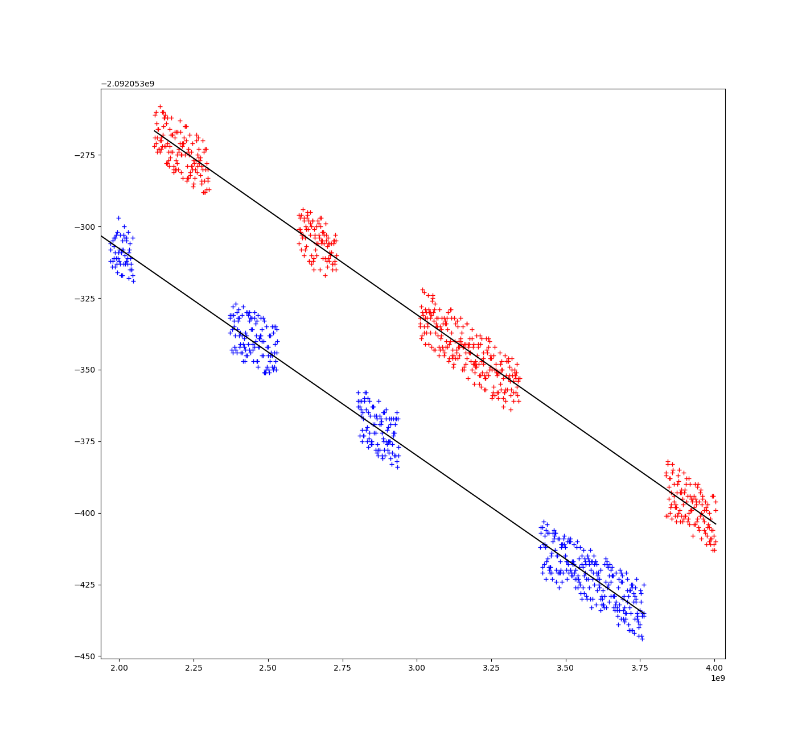

<!--
SPDX-FileCopyrightText: Copyright Christian Amsüss <chrysn@fsfe.org>, Silano Systems
SPDX-License-Identifier: MIT OR Apache-2.0
-->
Running hophop examples
=======================

For all examples
----------------

* Get an [nRF9151-DK](../doc/hardware.md), connect it and turn it on.

* Ensure you are set up to run Ariel OS examples.

  For the time being, it's easiest to follow the [Getting Started section in the Ariel OS book](https://ariel-os.github.io/ariel-os/dev/docs/book/getting-started.html).

* [Ensure that you have the DECT firmware running](../doc/dect-firmware.md).

* Beware that this is a research example,
  and that depending on your location, regulation on operating these devices does apply,
  especially as some examples emit transmissions controlled by the user alone.

* If ever you have multiple DKs connected,
  probe-rs will give you interactive options.

  You can skip that and statically set the probe to use
  by adding `-- --probe 1366:1059:xxxxxxxxxxxx` after the laze call (or withtout the `--` if you already).

Running the RSSI example
------------------------

* In this directory, run:

    ```console
    $ laze build -b nrf9151-dk run --bin rssi
    ```

    You can add the option `-D LOG=trace` before the `run` for more verbosity.

    The output this produces is a scan of Band 1, which is printed on screen;
    it's best to let that run through.

*   To visualize the output, store it by running

    ```
    $ laze build -b nrf9151-dk run --bin rssi -- --target-output-file=rssi.log
    ```

    and run the visualizer:

    ```
    $ ./show-rssi.py rssi.log
    ```

    (If anything is missing on the Python side, `pipx run ./show…` will fetch any missing components).

Running the RX example
----------------------

```
$ laze build -b nrf9151-dk run --bin rx
```

Note that this only produces output when data is sent on channel 1665;
use `dect ping -c` or `dect mac beacon_start -c 1665`
in the Nordic `dect_shell` example to send data from another boad.

Running the TX example
----------------------

```
$ laze build -b nrf9151-dk run --bin tx
```

This produces a single manually crafted beacon on chnanel 1665
whenever Button 1 is pressed.
Beware that this does not perform LBYT:
The user is expected to monitor that channel in parallel.

Running the ping example
------------------------

Note that this is particularly experimental w/rt exploring radio:
This emits bursts of transmissions that may easily be outside of regulations,
and best done in isolation of any other systems in the 1.9GHz band.

This requires two boards both running the same software, so in two terminals:

```console
laze build -b nrf9151-dk -D LOG=info -d stable -- --probe 1366:1059:00105aaaaaaa --target-output-file delta-a.log
laze build -b nrf9151-dk -D LOG=info -d stable -- --probe 1366:1059:00105bbbbbbb --target-output-file delta-b.log
```

(For some serial numbers easily found with `probe-rs list`).

When both are up, take turns pressing the boards' button 1 in alternation for several seconds.
A device sends short beacon messages that contain a time stamp on its own clock;
whenever it receives a message, it prints that timestamp but also its own time stamp.
Time stamps are on a 69.120MHz clock, and count from startup.

You can visualize the results using `python3 show-ping.py delta-a.log delta-b.log`,
which (possibly after zooming in) shows something like this:



It shows:
* A red dot for all pairs of messages sent by one device and received by the other, and vice versa, along with respective trend lines.
* Vastly inhomogenous axes:
  The x axis spans the whole experiment (typically a minute),
  while the y axis (in the same units) typically has a range of a few hundred ticks (ie. several microseconds).
* For every event, the x axis expresses the average between the two devices' clocks,
  and the y axis expresses the difference between those clocks.
* If both clocks were perfect clocks (but not started at the same time),
  all lines would be horizontal, and their vertical position would express the time difference between their startup times.
  As clocks are not perfect, the slope shows that the two clocks are slowly drifting relative to each other.
  Drifts are typically in the sub-PPM range, in total.
* Dots of the same color scatter evenly around their center line with a width of approx. 20 ticks.
  This indicates that in some part of the transmit-receive cycle, there is a uniformly distributed random time offset.
* The red and blue center lines are about 50 ticks apart,
  leaving a space of 30 ticks.
  This corresponds to some delay between transmission and reception.
  (Note that the time stamp at reception indicates when the STF was recognized, so this may just be the time that recognition takes).

  In theory, devices further apart should have that space widen by approx. 1 tick every 5m in distance.
